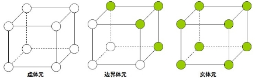
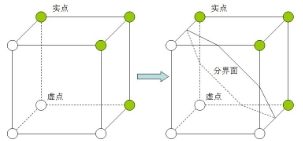
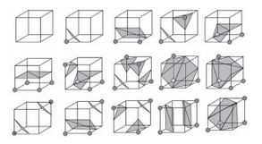
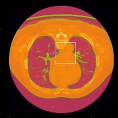

# CT人体组织分割               

**1. 项目介绍**

`  `本项目基于CT，对人体组织进行扫描，从而获得不同组织和器官的三维成像。CT可以根据人体不同组织对X线的吸收与透过率的不同，应用灵敏度极高的仪器对人体进行测量，然后将测量所获取的数据输入电子计算机，电子计算机对数据进行处理后，就可摄下人体被检查部位的断面或立体的图像，发现体内任何部位的细小病变。

**2. 项目实施过程**

**2.1数据来源**

数据来自Kaggle数据集**Finding and Measuring Lungs in CT Data**[1]

本次课程项目中采用的数据来自一场Kaggle线上通过对肺部的CT扫描来预测患者肺功能损伤程度的算法竞赛中的所提供的数据源。在网站提供的数据集中，包含一组患者的基线胸部CT扫描和相关临床信息。

常见的CT图像数据类型分别为dicom以及NIFTI(.nii)，其中dicom类型数据大多为文件夹形式，不便于我们对其进行后续的操作处理，为利于将来进行处理，我们选择了.nii格式的数据。随后通过使用nibabel对所下载的CT图像数据进行导入，其中最重要的数据包括CT扫描得到的体素单位和HU值。

HU（Hounsfield）[2]是CT扫描中的测量单位，是CT 图像中各组织与X 线衰减系数相当的对应值。无论是矩阵图像或矩阵数字都是CT值的代表，而CT值又是从人体组织、器官的μ值换算而来的。 CT值不是绝对不变的数值，它不仅与人体内在因素如呼吸、血流等有关，而且与X 线管电压、CT装置、室内温度等外界因素有关。

HU=1000×μ-μwaterμwater-μair

|组织分类|HU值|组织分类|HU值|组织分类|HU值|组织分类|HU值|
| - | - | - | - | - | - | - | - |
|空气|-1000|脑灰质|40±10|渗出液|>18±2|淋巴结|45±10|
|脂肪|-90±10|脑白质|25±10|漏出液|<18±2|胰腺|40±10|
|水|0|肌肉|45±5|致密骨|>250|肾脏|30±10|
|凝固血|80±10|甲状腺|70±10|松质骨|130±100|胰腺|40±10|
|静脉血|55±5|肝脏|60±5|渗出液(蛋白质>30g/L)|>18±2|淋巴结|45±10|
|血浆|27±2|脾脏|45±5|漏出液(蛋白质<30g/L)|<18±2|||

图1 不同组织的HU值

**2.2数据预处理**

2.2.1滤波

通过观查已导入的数据集，我们发现大部分的CT图像上存在着类似为高斯噪声的噪声干扰，所以需要对图像首先进行滤波，在滤波方案选择方面分别选择采用均值滤波，以及高斯滤波。

均值滤波是典型的线性滤波算法，在图像上对目标像素给一个模板，该模板包括了其周围的临近像素，我们选用了[3\*3\*3]的矩阵作为模板，再用模板中的全体像素的平均值来代替原来像素值。

高斯滤波是一种线性平滑滤波，就是对整幅图像进行加权平均的过程，每一个像素点的值，都由其本身和邻域内的其他像素值经过加权平均后得到，我们选择参数sigma=1，order=3。

2.2.2重采样

对于CT图像，通常以患者的一次拍摄为一个文件夹，文件夹下有一序列的.nii文件，每个文件称为一个切片（slice）。但是每个患者的情况不同，所以切片间的间距不同，例如有的像素间距为[2.5, 0.5, 0.5]，代表着切片间的距离是2.5毫米，而另一张CT的切片间距则可能是1.5毫米，这将会对于我们进行后续处理分析带来问题。

为了解决切片间距的不确定，我们将采用重采样的方法，即将整个数据集重新采样为相同分辨率的切片，经过多次尝试，我们决定将所有数据中的CT图像进行重采样，确定切片间距为1毫米，然后再进行后续处理。

**2.3 CT组织分割与体素绘制**

2.3.1传统分割方法

（1）分水岭算法[3]

`    `分水岭算法是从地形学发展而来的。假设把一滴水放在某点的位置上是，水一定会下落到一个单一的最小值点。对一个特定区域最小值，满足这个条件的店的集合被称为这个最小值的“集水盆地”，而组成地形表面的峰线被称为“分水岭”。当水处在“分水岭”上，组成水的全部小水滴会流向至少两个最小值点。

如果把图像的灰度空间看作地理结构，每个像素的灰度值代表高度。其中的灰度值较大的像素连成的线可以看做山脊，也就是分水岭。其中的水就是用于二值化的gray threshold level，二值化阈值可以理解为水平面，比水平面低的区域会被淹没，刚开始用水填充每个孤立的山谷(局部最小值)。

图2  分水岭示意图

当水平面上升到一定高度时，水就会溢出当前山谷，可以通过在分水岭上修大坝，从而避免两个山谷的水汇集，这样图像就被分成2个像素集，一个是被水淹没的山谷像素集，一个是分水岭线像素集。最终这些大坝形成的线就对整个图像进行了分区，实现对图像的分割。

但是分水岭算法存在两点不完善的地方：第一点是参考图像决定了分割性能； 第二点缺陷是于图像分割的目标不相同，因为小的目标太过于具体，而只用其中一种或几种特征提出的梯度参考图像，对这些具体的情况 不能做出详细的判断，所以分割以后的所选用区域要做相似性检验，以便成为所需的区域。

`   `（2）区域生长算法[4]

区域生长的基本思想是将具有某种相似性质的象素集合起来构成区域。具体先对每一个需要分割的区域找一个种子像素作为生长的起点，然后将种子象素周围邻域中与种子像素有相同或相似性质的像素合并到种子像素所在的区域中。将这些新像素当做新的种子像素继续进行上面的过程，直到再没有满足条件的像素可被包括进来。

设分割区域R的灰度均值为x，待测像素点灰度为y，则待测像素点与已分割区域相性s表示为*
s=ωy-x

式中ω为非负权值。对于足够小的s，可认为待测像素与已分割区域相似，并入已分割的目标中，否 则，不进行合并。同时用y更新均值。xnew=x+yn+1式中，n是已生长区域的像素个数。

区域分割方法对所有的具有边界效应的图像，或者是该区域与外界区域有明显差距的图像，分割效果较好；若应用在区域与外接区域存在边缘连通现象的图像，分割效果很差。

2.3.2阈值分割法[5]

在本项目中，采用了阈值分割法中最佳阈值的思想。根据具体的分割对象问题来确定最佳阈值，一般通过实验来确定。对于给定的图象，可以通过分析直方图的方法确定最佳的阈值，例如当直方图明显呈现双峰情况时，可以选择两个峰值的中点作为最佳阈值。

`                            `图3 最佳阈值的选择

本项目中，我们根据不同组织的辐射密度（即HU值）作为确定最佳阈值的准则，以提取目标体素结构。

I(x,y)=0,I(x,y)<T1,I(x,y)>T

2.3.3 MarchingCubes体素绘制[6]

MarchingCubes算法（简称MC算法）是一种用于显示三维图像内容的算法，它可以对内容表面建立一个三角形网格模型，后在三角网格内进行渲染就能够在屏幕上看到想要的内容。MC算法具有生成网格的质量好，同时具有很高的可并行性的优点。

Figure 体元

MC算法中有非常重要的概念：体元。体元是在三维图像中由相邻的八个体素点组成的正方体方格。 一个宽高层数分别为width、height、depth的三维图像，其体素的对应的x，y，z方向的索引范围分别0~width-1、0~height-1、0~depth-1。根据MC算法的思想，这个体可以划分出(width-1)\*(height-1)\*(depth-1)个体元。为了给每个体元定位，对于一个特定的体元，使用这个体元x、y、z方向上坐标都是最小的那个体素为基准体素，以它的x、y、z索引作为这个体元的x、y、z索引。

这样可以把这个体元中的体素进行编号：

MC算法的主要思路是以体元为单位来寻找三维图像中内容部分与背景部分的边界，在体元抽取三角片来拟合这个边界。将包含体数据内容的体素点称为实点，而其外的都称作虚点。那么一个三维图像就可以看作由各种实点和虚点组成的点阵。从单个体元的角度出发，体元的8个体素点每个都可能是实点或虚点，那么一个体元一共有2的8次方即256种可能的情况。MC算法的核心思想就是利用这256种可以枚举的情况来进行体元内的等值三角面片抽取。对于一般的三维图像来说，8个体素全是虚的或者全是实的体元叫做虚体元和实体元；而第三种情况是这个算法最为关心的，就是一个体元中既有实点也有虚点，这样的体元被称为边界体元。在三维图像中想求出介于实点和虚点之间的表面，就要在他们的边界，也就是边界体元内设法求出虚实体素之间的等值面。MC算法的另外一大思想就是使用三角片去拟合等值面。因为一个体元相对于图像是一个极小的局部，所以穿过该体元等值面就可以近似由小三角形片来拟合。例如下面的体元配置，就可以认为等值面的一部分就是以这样的方式穿过体元。

所有的256种配置都是这15种基本构型由旋转，对称变换等操作转变而成。每一种体元配置中等值面都是由若干个三角形片构成。这样针对这些有限的三角片分布情况，可以制作一个表来表示所有256种配置的三角形情况，这个表一共有256行，每行能表示该体元配置下三角形的情况。从图中可以看出，组成等值面的三角形的三个顶点一定是穿过体元的边的，所以可以用三条边的索引来表示一个三角形。

基于骨骼的HU值（HU:300-400)，我们得到了椎骨和胸骨的绘制结果：

`          `图4   椎骨和胸骨的绘制结果

我们还以HU=-200提取出了肺叶组织的影像：

图5    肺叶组织

肺叶体素中的空隙是支气管：

图6  肺叶中的空隙

因此使用形态学闭合操作把前面提取的肺闭合再做减法就提取出了支气管影像 ：

图7   支气管绘制结果

2.3.4深度神经网络UNet++分割方法[7]

UNet++是在UNet的基础上改进而来的，作为广泛运用于医学图像分割的模型，UNet主要有两个限制：网络的最佳深度会因任务难度和可用于训练的标记数据量而异。其次，在编码器-解码器网络中使用的跳接的设计受到不必要的限制，要求融合相同比例的编码器和解码器特征图。尽管是自然设计，但来自解码器和编码器网络的相同比例的特征图在语义上并不相同，没有可靠的理论保证它们是特征融合的最佳匹配。

UNet++是为了克服以上限制的新型通用图像分割体系结构。为了克服上述限制，原作者从UNet中删除了原始的跳接，并连接集合中的每两个相邻节点，从而产生了一种新的架构，称之为UNet+。由于采用了新的连接方案，UNet+连接了不相交的解码器，从而实现了从较深的解码器到较浅的解码器的梯度反向传播。UNet+通过向解码器中的每个节点提供在较浅的流中计算的所有特征图的聚合，进一步放松了跳接的不必要的限制性行为。尽管在解码器节点上使用聚合的特征图的限制远少于仅从编码器获得相同比例的特征图，但仍有改进的空间。同时进一步建议在UNet+中使用密集连接，从而得出最终的架构建议，将其称为UNet++。通过密集的连接，不仅为解码器中的每个节点提供了最终的聚合特征图，而且还提供了中间的聚合特征图和来自编码器的原始等比例特征图。这样，解码器节点中的聚合层可以学习仅使用相同比例的编码器特征图或使用在门处可用的所有收集的特征图。与UNet不同，UNet+和UNet++不需要深度监督，但是，正如将在后面描述的那样，深度监督可以在推理期间剪枝模型，从而显着加快性能，而性能只会适度下降。

如上图所示，UNet++由不同深度的U-Net组成，其解码器通过重新设计的跳接以相同的分辨率密集连接。 UNet++的体系结构具有以下优点。首先，UNet++不易明确地选择网络深度，因为它在其体系结构中嵌入了不同深度的U-Net。所有这些U-Net都部分共享一个编码器，而它们的解码器则交织在一起。通过在深度监督下训练UNet++，可以同时训练所有组成的U-Net，同时受益于共享的图像表示。这种设计不仅可以提高整体分割性能，而且可以在推理期间修剪模型。其次，UNet++不会受到不必要的限制性跳接的限制，在这种情况下，只能融合来自编码器和解码器的相同比例的特征图。UNet++中引入的经过重新设计的跳接在解码器节点处提供了不同比例的特征图，从而使聚合层可以决定如何将跳接中携带的各种特征图与解码器特征图融合在一起。通过以相同的分辨率密集连接组成部分U-Net的解码器，可以在UNet++中实现重新设计的跳接。

由于我们收集的数据集过于有限，因此借助Kaggle上公开的UNet++预训练模型[8]，基于此模型对我们收集的CT图像横断面进行分割，并与传统方式比较结果。

**3. 项目结果分析**

**3.1 图像滤波结果**

图8  滤波前                      均值滤波后                 高斯滤波后

通过我们的观察发现，原图噪声类似与高斯噪声，在采用了两种不同的滤波算法进行对比后，更适用于消除高斯噪声的高斯滤波有着更好的效果。

**3.2肺叶分割提取结果**

图9 传统方法

图10 基于UNet++

由图1结果所示，其中已使用绿线将肺叶的分割结果所勾勒出来，使用传统方法比如区域生长，分水岭法所分割的CT图像效果依旧十分明显，分割速度快。但是存在着较大的使用局限性，例如若CT图像所拍摄的是没有明显CT区分度的组织结构时，分割效果就将大打折扣，同时对于复杂结构的处理，需要额外的形态学处理与其配合，才能获得理想的结果。

由图2结果所示，其中的淡黄色区域为我们分割提取后的肺叶区域，采用了基于深度学习的分割方法后，效果同样显著，同时为端到端操作，即使分割速度上与传统方法相比不占优势，但是采用电脑的GPU加速，将GPU的算力一并加入，其运算效率并不会落后与传统分割方法。同样的基于深度学习的方法也存在自身的缺陷，分割前对于原图像有着更严格的要求，如图像输入尺寸与样式有着严格的限制，我们这次采用的的255\*255格式，在尺寸确定后还需要对数据进行预处理和归一化后才能开始分割。

横向对比两种方法所分割出的肺叶图像，就效果层面而言，基于深度学习UNet++的分割方法有着更优秀的结果，可以看到图中所标出的黄色区域非常精准确定了肺叶，而传统方法所切割后的绿色勾勒线，在勾勒出肺叶的同时，误切割出了皮肤与气管，影响了最终的准确性。UNet++的分割方法直接提取了肺部的Mask，所以获得更加精确的结果，分割效果更优秀，在结构上二者也具有较高的一致性，且分割结果完全符合肺部的解剖结构特征，所以UNet++方法是更为优秀的。

**3.3用户交互界面: PyQT5**

在界面的左上方，通过单击按钮导入文件，文件的路径会在右侧显示；点击Filter，调用高斯滤波对图像进行降噪处理；RESAMPLE按钮将图像重采样为固定格式，便于进行后续处理；DATA INFO会向用户展示文件的基本信息，当前采样间隔，所选取的等值面。

下方分割选择的下拉框可以选择分割的组织为骨骼或肺叶或支气管；取色按钮用于修改体素颜色；绘制体素按钮通过使用Marching Cube算法提取体素的Mesh然后绘制3D图像，在界面的最右侧展示在画面上可以直接拖曳缩放。

中间的图片展示的是通过传统分割方法的分割结果，绿色勾勒线所框为目标区域，右侧显示总体的灰度直方图，拖动其中的绿线可以调整等值面的选值，图中白色框选的的区域直方图在下方显示，拖动左侧3个滑动条，可以调节冠状面，矢状面，横断面的参数从而改变切片图。

在界面最下方展示的是为基于UNet++的分割结果，黄色区域为目标区域。

**4. 总结与心得体会**

本学期课程多，项目任务重，在获得项目题目的我们第一时间决定通过自制X光CT成像系统来获得CT图像进行分割重建，不过因为辐射剂量原因，始终无法得到清晰可见的图像来进行后续处理，因此在最后临时更改数据来源，再从头开始进行处理，对我们而言是个挑战。所以在此期间，我们不断查找资料，一同讨论，并在完成大体要求后不断改进算法，使结果更为准确。

本报告主要从项目实施方案、项目实施过程、运行结果与分析等几个方面来展开。通过本次课程项目设计，我们可以从中总结学习专业知识并提高综合能力，增强自身的动手实践、将理论转化为实践的能力。在整个过程中，虽然会遇到不会或难以解决的问题，但是可以通过各种渠道想方设法解决完成。所以客观来说，既增强了我们独立解决问题的能力，又培养了我们受挫后心里承担能力。

**5. 参考文献**

[1]	Scotter, K. (2017). Finding and Measuring Lungs in CT Data, Version 2. Retrieved February 20, 2022 from https://www.kaggle.com/kmader/finding-lungs-in-ct-data 

[2]	Wikipedia contributors. (2022, February 16). Hounsfield scale. In Wikipedia, The Free Encyclopedia. Retrieved 07:54, February 27, 2022, from https://en.wikipedia.iwiki.eu.org/w/index.php?title=Hounsfield\_scale&oldid=1072238718

[3]	Sijbers, J., Scheunders, P., Verhoye, M., Van der Linden, A., Van Dyck, D., & Raman, E. (1997). Watershed-based segmentation of 3D MR data for volume quantization. Magnetic Resonance Imaging, 15(6), 679-688.

[4]	Adams, R., & Bischof, L. (1994). Seeded region growing. IEEE Transactions on pattern analysis and machine intelligence, 16(6), 641-647.

[5]	Zhang, J., Yan, C. H., Chui, C. K., & Ong, S. H. (2010). Fast segmentation of bone in CT images using 3D adaptive thresholding. Computers in biology and medicine, 40(2), 231-236.

[6]	Rajon, D. A., & Bolch, W. E. (2003). Marching cube algorithm: review and trilinear interpolation adaptation for image-based dosimetric models. Computerized Medical Imaging and Graphics, 27(5), 411-435.

[7]	Zhou, Z., Rahman Siddiquee, M. M., Tajbakhsh, N., & Liang, J. (2018). Unet++: A nested u-net architecture for medical image segmentation. In Deep learning in medical image analysis and multimodal learning for clinical decision support (pp. 3-11). Springer, Cham.

[8]	Xie29. (2021). Lung ct segmentation pretrain, Version 2. Retrieved February 15, 2022 from https://www.kaggle.com/kmader/finding-lungs-in-ct-data

